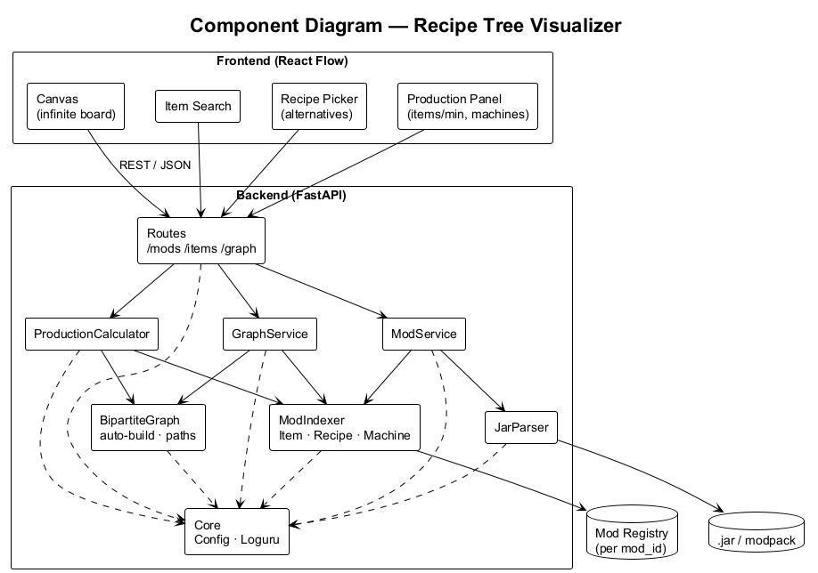
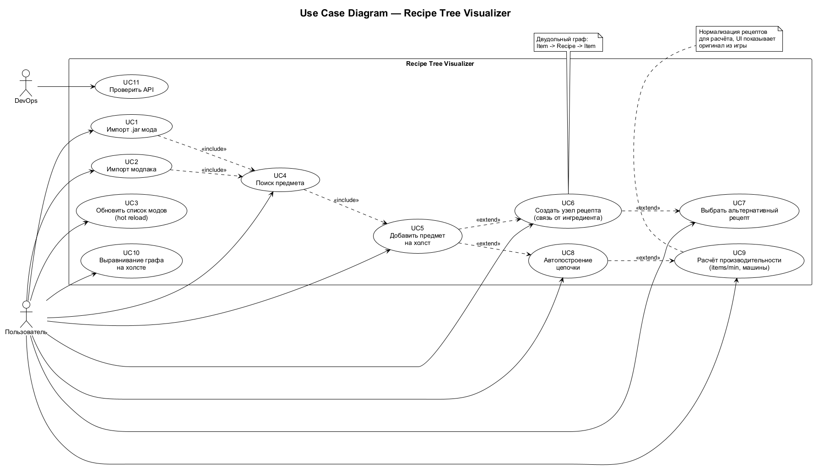
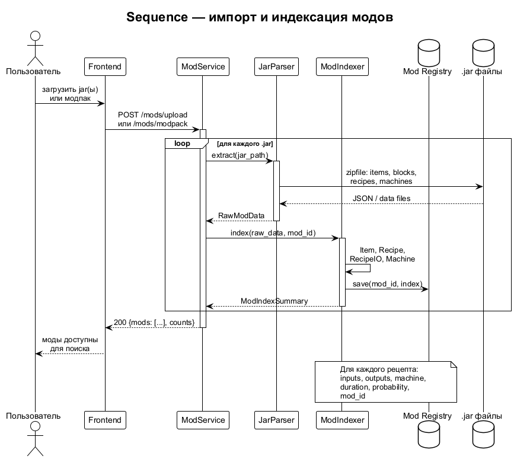
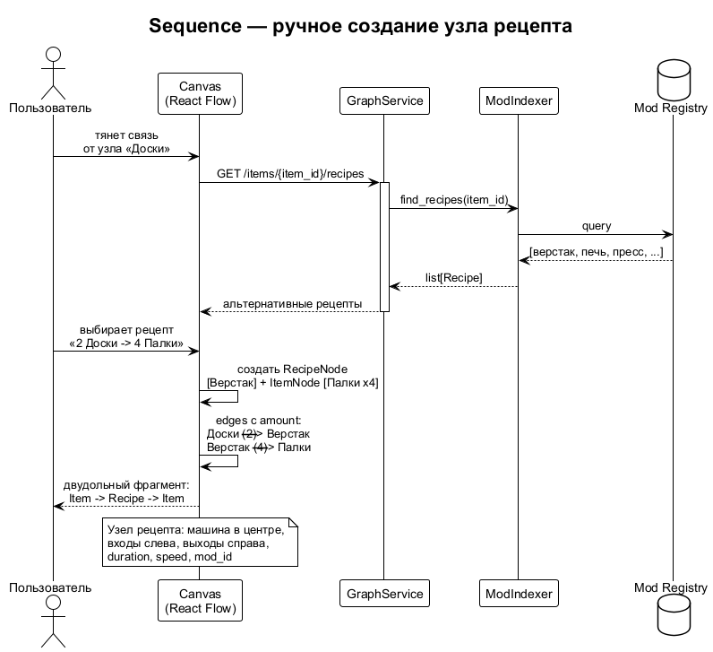
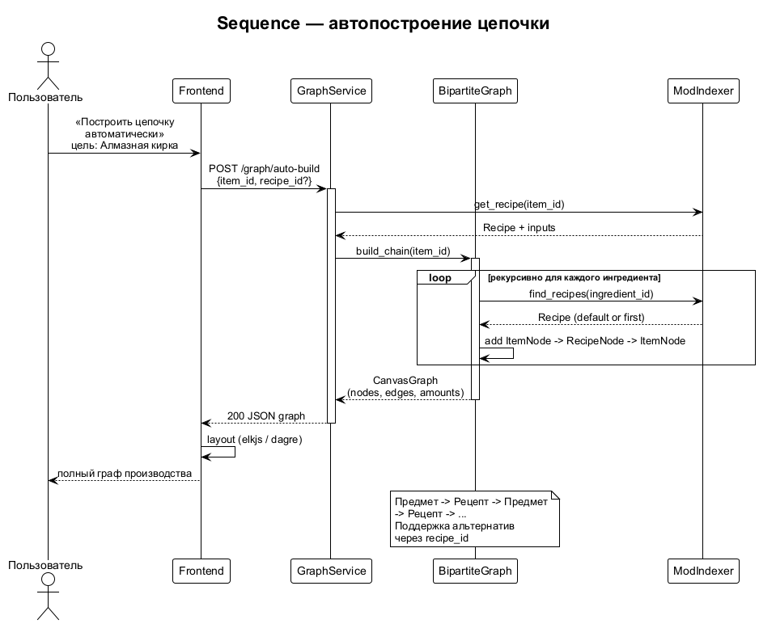
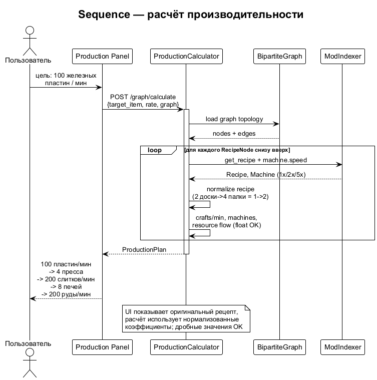
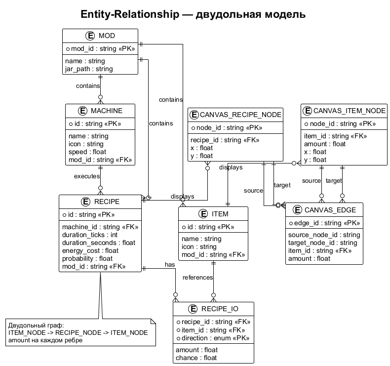

# Архитектура Recipe Tree Visualizer

## Общая идея

Приложение строит **интерактивные графы производства** для Minecraft (ванilla + моды).
Пользователь загружает один или несколько `.jar`, приложение индексирует предметы, рецепты и
машины, после чего на бесконечном холсте собирает цепочку крафта вручную или автоматически.

Референс по UX: производственные графы Factorio / Satisfactory, но с импортом данных из
Minecraft-модов.

## Ключевая модель: двудольный граф

Внутренняя модель — **не** «предмет связан с предметом линией», а двудольный граф:

```
Предмет → Рецепт → Предмет → Рецепт → Предмет
```

- **Узел ресурса (Item node)** — предмет/блок на холсте: иконка, название, количество.
- **Узел рецепта (Recipe node)** — машина/станция в центре, входы слева, выходы справа,
  длительность, скорость, mod-источник.

Рецепт — **отдельная сущность (нода)**, а не ребро между предметами. Это нужно и для
визуального редактора, и для расчёта производительности.

```
[2 Доски] ──► [Верстак] ──► [4 Палки]
```

## Обзор системы

```
┌──────────────────────────────────────────────────────────────┐
│  Frontend (React Flow canvas)                                │
│  поиск · холст · выбор рецепта · расчёт производительности   │
└────────────────────────────┬─────────────────────────────────┘
                             │ REST / JSON
┌────────────────────────────▼─────────────────────────────────┐
│  Backend (FastAPI)                                           │
│  routes → services → parser/indexer/graph/calculator         │
└────────────────────────────┬─────────────────────────────────┘
                             │
              ┌──────────────┼──────────────┐
              ▼              ▼              ▼
         .jar моды     Mod Registry    Graph state
```

## UML-диаграммы

Исходники PlantUML: [`docs/uml/`](uml/). Пересборка PNG:

```bash
cd docs/uml
java -jar plantuml.jar -tpng *.puml
```

### Диаграмма компонентов

  
Исходник: [`uml/components.puml`](uml/components.puml)

### Use Case

  
Исходник: [`uml/use-case.puml`](uml/use-case.puml)

### Sequence: импорт и индексация модов

  
Исходник: [`uml/sequence-import-mods.puml`](uml/sequence-import-mods.puml)

### Sequence: ручное добавление узла рецепта

  
Исходник: [`uml/sequence-manual-recipe.puml`](uml/sequence-manual-recipe.puml)

### Sequence: автопостроение цепочки

  
Исходник: [`uml/sequence-auto-build.puml`](uml/sequence-auto-build.puml)

### Sequence: расчёт производительности

  
Исходник: [`uml/sequence-production-calc.puml`](uml/sequence-production-calc.puml)

### Модель данных

  
Исходник: [`uml/entity-relationship.puml`](uml/entity-relationship.puml)

## Слои backend

| Слой | Каталог | Ответственность |
|------|---------|-----------------|
| **API (routes)** | `backend/app/api/routes/` | HTTP, валидация Pydantic, коды ответов |
| **Services** | `backend/app/services/` | Оркестрация сценариев (импорт, граф, расчёт) |
| **Parser** | `backend/app/parser/` | Чтение `.jar` (ZIP), извлечение JSON/data |
| **Indexer** | `backend/app/indexer/` | Сборка реестра: Item, Recipe, Machine по mod_id |
| **Graph** | `backend/app/graph/` | Состояние двудольного графа на холсте (manual-first) |
| **Calculator** | `backend/app/calculator/` | Нормализация рецептов, items/min, число машин |
| **Core** | `backend/app/core/` | Config из `.env`, Loguru |

Зависимости: `routes → services → parser/indexer/graph/calculator → core`.

## Модель данных (Pydantic)

```python
class Item(BaseModel):
    id: str
    name: str
    icon: str
    mod_id: str

class Machine(BaseModel):
    id: str
    name: str
    icon: str
    speed: float          # 1x печь, 2x электропечь, 5x индукционная

class RecipeIO(BaseModel):
    item_id: str
    amount: float
    chance: float | None = None   # побочные продукты

class Recipe(BaseModel):
    id: str
    machine_id: str
    inputs: list[RecipeIO]
    outputs: list[RecipeIO]
    duration_ticks: int | None = None
    duration_seconds: float | None = None
    energy_cost: float | None = None
    probability: float | None = None
    mod_id: str
```

### Узлы холста (DTO для фронтенда)

```python
class CanvasItemNode(BaseModel):
    node_id: str
    item_id: str
    amount: float

class CanvasRecipeNode(BaseModel):
    node_id: str
    recipe_id: str
    machine_id: str
    inputs: list[RecipeIO]
    outputs: list[RecipeIO]
    duration_seconds: float | None

class CanvasEdge(BaseModel):
    source_node_id: str
    target_node_id: str
    item_id: str
    amount: float          # подпись на связи: Доски --(2)-->
```

## UX-сценарий

> **Импорт мода не строит граф.** После индексации холст пуст — каждую ноду добавляет пользователь
> (референс: Satisfactory Modeler).

1. Пользователь загружает мод(ы) или модпack → каталог пополняется, **холст пуст**.
2. Backend парсит `.jar` и индексирует предметы / рецепты / машины.
3. Пользователь ищет предмет (например, «Механическая рука (Create)»).
4. Предмет появляется на холсте как **узел ресурса** (явное действие пользователя).
5. От ингредиента тянет связь → открывается **выбор рецепта** (верстак / печь / пресс / …).
6. Создаётся **узел рецепта** с входами слева и выходами справа.
7. Продолжает раскрывать ингредиенты, добавляя ноды по одной.
8. При необходимости переключает **альтернативный рецепт** того же предмета.
9. Задаёт целевой выход (100 пластин/мин) — backend считает машины и потребление для **текущего** графа.

## Расчёт производительности

- Пользователь задаёт целевой выход (например, `100 железных пластин/мин`).
- Backend **нормализует** рецепты для расчёта (2 доски → 4 палки ≡ 1 → 2), но в UI
  показывается **оригинальный** рецепт из игры.
- Учитывается **speed** машины (печь 1x, электропечь 2x, …).
- Допускаются **дробные** значения (7 палок/с → 3.5 доски/с).
- Результат: количество машин на этап, потребление сырья, промежуточные продукты.

Пример:

```
100 пластин/мин → 4 пресса → 200 слитков/мин → 8 печей → 200 руды/мин
```

## API-контракт (черновик)

| Метод | Путь | Назначение |
|-------|------|------------|
| GET | `/health` | Проверка состояния |
| POST | `/mods/upload` | Загрузка одного или нескольких `.jar` |
| POST | `/mods/modpack` | Загрузка модпака (архив / набор jar) |
| GET | `/mods` | Список загруженных модов |
| DELETE | `/mods/{mod_id}` | Удаление мода из индекса (hot reload) |
| GET | `/items/search` | Поиск предмета по имени |
| GET | `/items/{item_id}/recipes` | Альтернативные рецепты предмета |
| GET | `/machines/{machine_id}` | Данные машины (speed, icon) |
| POST | `/graph/calculate` | Расчёт производительности для текущего графа |
| GET | `/docs` | Swagger UI |

## Структура репозитория (целевая)

```
Recipe-Tree-Visualizer/
├── backend/
│   ├── app/
│   │   ├── api/routes/
│   │   ├── services/
│   │   ├── parser/
│   │   ├── indexer/
│   │   ├── graph/
│   │   ├── calculator/
│   │   ├── schemas/
│   │   └── core/
│   └── tests/
├── frontend/                 # React Flow — бесконечный холст
├── docs/
│   ├── architecture.md
│   └── uml/                  # .puml + .png
├── docker-compose.yml
├── .env.example
└── README.md
```

## Принципы

- **Универсальность** — без хардкода под конкретный мод; любой mod с items/recipes/machines.
- **Двудольный граф** — рецепт всегда отдельная нода между предметами.
- **Много входов/выходов** — рецепты GregTech-уровня (10+ входов, побочные продукты).
- **Самодостаточный backend** — REST + Swagger для демонстрации на защите.
- **Секреты в `.env`**, логирование Loguru (INFO / ERROR, консоль + ротация файлов).
